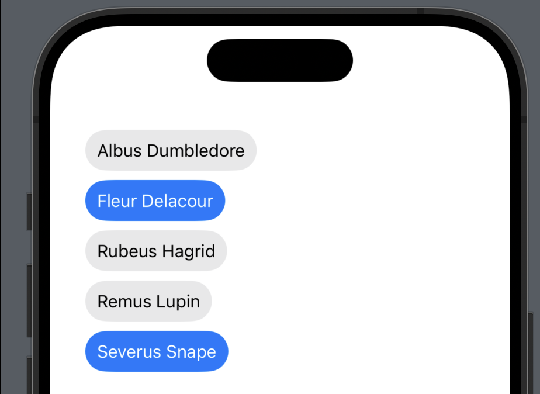
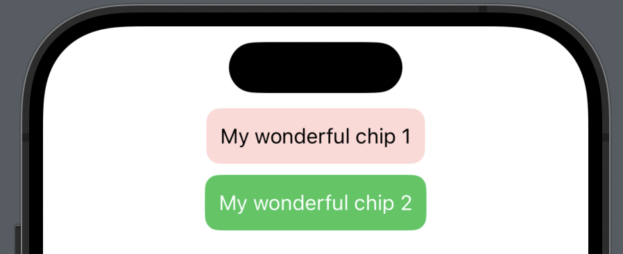

# Chip

**Chip are compact element that represent an input, attribute, or action**. 

<!-- PROJECT SHIELDS -->
<div align="center">


[](https://img.shields.io/badge/Swift-5.8-Orange?style=flat)

[](https://img.shields.io/badge/Platforms-iOS-Green?style=flat)
[](https://img.shields.io/badge/Swift_Package_Manager-compatible-orange?style=flat)
</div>

<!-- PROJECT LOGO -->
<br />
<div align="center">
  <a href="https://github.com/Torear797/Chip">
    
  </a>
</div>

## Navigate

- [Installation](#installation)
  - [Swift Package Manager](#swift-package-manager)
- [Usage](#usage)
- [Customisation](#customisation)
- [License](#license)

## Installation

Ready to use on iOS 13+. Working with `SwiftUI`.

### Swift Package Manager

In Xcode go to Project -> Your Project Name -> `Package Dependencies` -> Tap _Plus_. Insert url:

```
https://github.com/Torear797/Chip
```

or adding it to the `dependencies` of your `Package.swift`:

```swift
dependencies: [
    .package(url: "https://github.com/Torear797/Chip", .upToNextMajor(from: "1.0.0"))
]
```

</details>

### Manually

If you prefer not to use any of dependency managers, you can integrate manually. Put `Sources/Chip` folder in your Xcode project. Make sure to enable `Copy items if needed` and `Create groups`.

## Usage

```swift
import Chip

@State var isOn = false

var body: some View {
    Chip("My wonderful chip", isOn: $isOn)
}
```

## Customisation

You can customize the chip using styles:

```swift
struct MyCustomeChipStyle: ChipStyle {
    func makeBody(configuration: Configuration) -> some View {
        MyCustomeChipStyle(configuration: configuration)
    }
    
    private struct MyCustomeChipStyle: View {
        
        // MARK: Constants
        
        private let textFont = Font.subheadline
        private let textColor = Color.black.opacity(0.7)
        private let backgroundUnselectedColor = Color.red.opacity(0.2)
        private let backgroundSelectedColor = Color.green
        private let borderColor = Color.gray
        private let height: CGFloat = 40
        private let radius: CGFloat = 10
        private let configuration: ChipStyleConfiguration
        
        init(configuration: ChipStyleConfiguration) {
            self.configuration = configuration
        }
        
        private var backgroundColor: Color {
            configuration.$isOn.wrappedValue
            ? backgroundSelectedColor
            : backgroundUnselectedColor
        }
        
        private var fontColor: Color {
            configuration.$isOn.wrappedValue ? .white : .black
        }
        
        var body: some View {
            configuration
                .label
                .font(textFont)
                .foregroundColor(fontColor)
                .lineLimit(1)
                .frame(height: height)
                .padding(.horizontal, 10)
                .background(backgroundColor)
                .clipShape(.rect(cornerRadius: radius))
                .animation(.default, value: configuration.isOn)
        }
    }
}
```

```swift
VStack {
    Chip("My wonderful chip 1", isOn: $isOn)
        .chipStyle(MyCustomeChipStyle())
            
    Chip("My wonderful chip 2", isOn: $isOn2)
        .chipStyle(MyCustomeChipStyle())
}
```

<br />
<div align="center">
  <a href="https://github.com/Torear797/Chip">
    
  </a>
</div>

### Custom Label

```swift
        Chip(isOn: $isOn) {
            HStack {
                Image(systemName: "xmark")
                
                Text("My Custom Label")
                    .font(.system(size: 25))
            }
        }
```

### Custom Action

```swift
        Chip(isOn: $isOn) {
            HStack {
                Image(systemName: "xmark")
                
                Text("My Custom Label")
                    .font(.system(size: 25))
            }
        } action: {
            print("Alohomora")
        }
```

## Add an extension for convenience

```swift
extension ChipStyle where Self == MyCustomeChipStyle {
    static var myCustomeChipStyle: Self { .init() }
}
```

```swift
Chip("My wonderful chip", isOn: $isOn)
    .chipStyle(.myCustomeChipStyle)
```

## License

Chip is released under the MIT license. [See LICENSE](https://github.com/Torear797/Chip/blob/main/LICENSE) for details.
